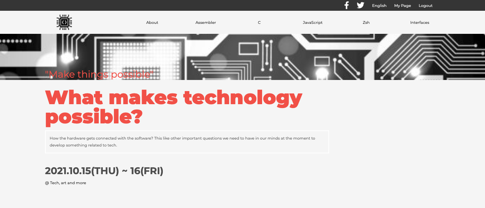
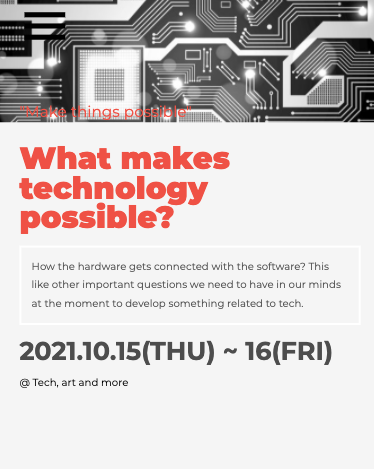
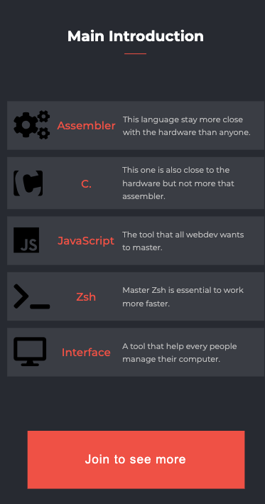
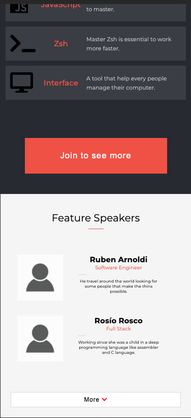
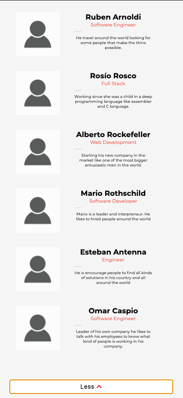

# Programming languages

> This is about programming languages.

- Desktop Version

- Mobile Version

Mobile ScreenShots

## Link of Web Page

- GitHub Pages: [@er-contreras](https://er-contreras.github.io/first-capston/)

## Built With

- HTML, CSS & JS

## Live Demo

[Live Demo Link](https://er-contreras.github.io/first-capston/)

## Video Presentation

[Video Presentation](https://www.loom.com/share/67f5a6e944b44e33a81bcbf36ee36cfb)

## Skills

  - Systematic
  - Creative
  - Persistent

## Getting Started

### Prerequisites
  - You should have VS Code installed or have the source-code editor of your preference.
### Setup
  - Paste the link of the repo (you can find it in the tab "Code").
### Install
  - Use terminal to install it. You can use git clone follow by link of the repo.
### Usage
  - Create a branch to make improvements in the project.

## Authors

👤 **Christian Erick Contreras**

- GitHub: [@er-contreras](https://github.com/er-contreras)
- Linkedin: [LinkedIn](https:linkedin.com/in/er-contreras-9945b820b)
- Twitter: [@er_contreras_](https://twitter.com/er_contreras__)

## Show your support

Give a ⭐️ if you like this project!

## Acknowledgments

- Microverse
- We use [Cindy Shin Behance](https://www.behance.net/gallery/29845175/CC-Global-Summit-2015) example to built this page.

## 📝 License

-  This work is licensed under a <a rel="license" href="http://creativecommons.org/licenses/by-nc/4.0/">Creative Commons Attribution-NonCommercial 4.0 International License</a>.
