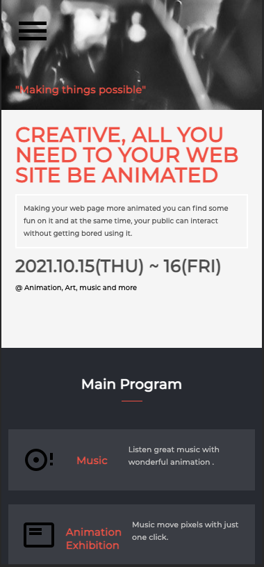
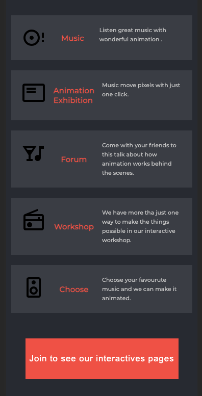

# Animation and Music

> This is about a animation and music page.

Mobile ScreenShots

## Link of Web Page

- GitHub Pages: [@eri8-9](https://eri8-9.github.io/concert-project/)

## Built With

- HTML, CSS & JS

## Skills

  - Systematic
  - Creative
  - Persistent

## Getting Started

### Prerequisites
  - You should have VS Code installed or have the source-code editor of your preference.
### Setup
  - Paste the link of the repo (you can find it in the tab "Code").
### Install
  - Use terminal to install it. You can use git clone follow by link of the repo.
### Usage
  - Create a branch to make improvements in the project.

## Authors

👤 **Christian Erick Contreras**

- GitHub: [@eri8-9](https://github.com/eri8-9)
- Linkedin: [LinkedIn](https:linkedin.com/in/christian-erick-contreras-9945b820b)
- Twitter: [@ChristianErick_](https://twitter.com/ChristianErick_)

## Show your support

Give a ⭐️ if you like this project!

## Acknowledgments

- Microverse
- We use [Cindy Shin Behance](https://www.behance.net/gallery/29845175/CC-Global-Summit-2015) example to built this page.

## 📝 License

This project is [MIT](./MIT.md) licensed.